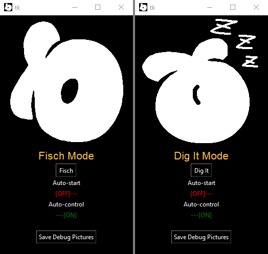

## About

A modular bot for automating Fisch-like games using computer vision.

Also known as a Fisch macro, Fisch bot, Fisch script, Dig It macro, Dig It bot, Dig It script.

Compatible with:
- Fisch
- Dig It

## Setup and Usage

It is recommended to use a Python virtual environment to run this script.

- Open a command prompt terminal in the repository directory and run `python -m venv .venv` to create a virtual environment in the `.venv` directory.
- Activate the virtual environment: `.venv\Scripts\activate.bat`
- Install the requirements: `pip install -r requirements.txt`.
- Run the script: `python main.py`.
  - Terminate it by closing the command prompt window or put the window into focus and press `Ctrl+C` to break out of the script.
- You will have to activate the virtual environment before running the script if you are in a fresh command prompt terminal, so it is recommended to use the terminal in an editor (like Code) that will automatically activate the Python virtual environment.

### Special Considerations for Dig It

There are a few additional considerations for setting up the configuration for Dig It.

`edge_rect` should be the area in the black border that is equal width to the inside of the bar, but positioned on the outline. The cursor that the player controls should be the only thing moving left and right across the black outline in this area.
`sample_coord` should be a position that is in the colored outline and it shouldn't be in the way of the sideways moving cursor. This coordinate will be used to sample the color of the target bar.

## Setup and Usage

A video demonstration of configuring the bot will be provided in the future, but for now I hope that these text instructions can suffice.

It is recommended to use a Python virtual environment to run this script.

- Open a command prompt terminal in the repository directory and run `python -m venv .venv` to create a virtual environment in the `.venv` directory.
- Activate the virtual environment: `.venv\Scripts\activate.bat`
- Install the requirements: `pip install -r requirements.txt`.
- Run the script: `python main.py`.
  - Terminate it by closing the command prompt window or put the window into focus and press `Ctrl+C` to break out of the script.
- You will have to activate the virtual environment before running the script if you are in a fresh command prompt terminal, so it is recommended to use the terminal in an editor (like Code) that will automatically activate the Python virtual environment.

There is an AFK fail-safe for auto-cast if no action is performed after 60 seconds. This will allow Roblox's default AFK timer to tick until completion.

To untrip the fail-safe, you can manually initiate the "control" minigame (reeling for Fisch, just start digging in Dig It) to reset the AFK fail-safe and timer.

If no action is performed after 10 minutes, the script will automatically break out of the loop and terminate. These failsafes will also print their time of occurrence in the case that it might line up with an expected server shutdown or otherwise.

---

Hard coded values only need to be configured if the presets do not work.

To determine new configuration values, you will have grab screenshots containing the following information:

- Fisch
  - `button_scales` Shake button diameter(s)
    - The Steady Rod uses a larger diameter shake button
  - `reel_rect` Reel bar top left coordinates (x, y) and size (width, height)
  - `prompt_rect` A rectangle $(x, y, w, h)$ that is arbitrarily larger around the area in which the minigame-specific prompt appears
- Dig It
  - `reel_rect` The "reel bar" which the target box appears in
  - `edge_rect` Area on the black outline of the minigame that ONLY contains the player-controlled bar
  - `sample_coord` Coordinate on the colored outline that will not contain any obstructions from which the target box's color can be sampled from
  - `prompt_rect` A rectangle $(x, y, w, h)$ that is arbitrarily larger around the area in which the minigame-specific prompt appears

File paths for template images can be configured on their own to point to the correct image if necessary or by preference.

The prompt image should be a transparent image containing the portion that is minigame-specific. In Fisch, this could be the text that says "Click & Hold Anywhere!", and likewise in Dig It it could be "Keep the cursor in the moving area". This image should be smaller than `prompt_rect`, and `prompt_rect` should be a rectangular area that is position accordingly and slightly larger than the prompt image.

Rectanglular areas (rects) are formatted as the (x, y) coordinates of the top left of the rectangle, followed by their (width, height). This produces a four-valued tuple $(x, y, w, h)$.

The variable `monitor_index` will not necessarily match the number that Windows indexes the monitors as, so executing the script with the `--debug` flag in the command line will produce a directory containing screenshots of all detected monitors named according to the index they are as detected by the script so that you may enter the correct number into the configuration.

---

Hotkeys are currently configured as so:

- `Ctrl+Shift+C` to toggle auto-starting (casting, start digging)
- `Ctrl+Shift+R` to toggle auto-control (shake button, reeling, shovelling)
